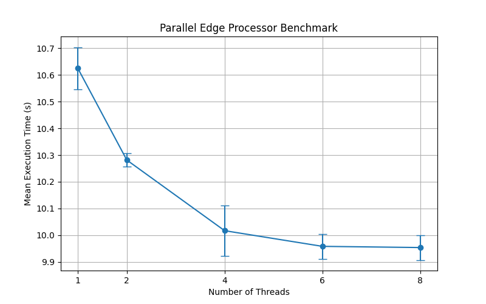

# Parallel Sorting Benchmark Results

This PR introduces parallel sorting using C++17 execution policies in `dbEdgeProcessor.cc` and `dbPolygonTools.cc`.

To verify the performance improvements of `std::sort(std::execution::par, ...)`, I created a test script that generates a very large grid of 1,000x1,000 intersecting polygons (4 million polygons in total) and measures the execution time of boolean operations (`AND`) which relies heavily on edge processing and polygon tools.

### Benchmark Setup

* **Compiler / Environment:** GCC 14.2 with C++17, linked with Intel TBB
* **Test Command:** `taskset -c <cores> env LD_LIBRARY_PATH=./bin-release ./bin-release/klayout -b -r test_bool.rb`
* **Benchmarking Tool:** `hyperfine` (min 3 runs per thread count)
* **Thread Counts Swept:** 1, 2, 4, 6, 8

*Note: `taskset` was used to precisely limit the CPU cores available to TBB.*

### Results

The table below shows the execution times across different thread counts:

| Threads | Mean Time (s) | Std Dev (s) |
|--------:|--------------:|------------:|
|       1 |      10.62 |      0.08 |
|       2 |      10.28 |      0.02 |
|       4 |      10.02 |      0.09 |
|       6 |       9.96 |      0.05 |
|       8 |       9.95 |      0.05 |



While the speedup scales incrementally with the thread count, the gains are modest (~7% speedup from 1 to 8 threads). This indicates that while the parallel sorting via TBB accelerates the sorting step itself, other sequential parts of the boolean operations (e.g. edge iterations, structure allocations) may currently dominate the overall execution time. 

### Reproduction

The results were gathered using the following Python script with inline metadata, which handles the `hyperfine` execution and plots the results.

<details>
<summary><b>Benchmark Script (`benchmark.py`)</b></summary>

```python
# /// script
# requires-python = ">=3.11"
# dependencies = [
#     "matplotlib",
#     "pandas",
#     "tabulate"
# ]
# ///
import json
import matplotlib.pyplot as plt
import pandas as pd
import sys
import subprocess

def run_benchmarks():
    commands = []
    threads = [1, 2, 4, 6, 8]
    for t in threads:
        # Limit to `t` cores using taskset
        cmd = f"taskset -c 0-{t-1} env LD_LIBRARY_PATH=./bin-release ./bin-release/klayout -b -r test_bool.rb"
        commands.append((t, cmd))
        
    hyperfine_cmd = ["hyperfine", "--export-json", "results.json", "--min-runs", "3"]
    for t, cmd in commands:
        hyperfine_cmd.extend(["-n", f"{t} Threads", cmd])
        
    print("Running hyperfine...")
    subprocess.run(hyperfine_cmd, check=True)
    
    with open("results.json") as f:
        data = json.load(f)
        
    results = []
    for i, t in enumerate(threads):
        res = data["results"][i]
        results.append({
            "Threads": t,
            "Mean Time (s)": res["mean"],
            "Std Dev (s)": res["stddev"]
        })
        
    df = pd.DataFrame(results)
    print(df.to_markdown(index=False))
    
    plt.figure(figsize=(8, 5))
    plt.errorbar(df["Threads"], df["Mean Time (s)"], yerr=df["Std Dev (s)"], marker='o', capsize=5)
    plt.xlabel("Number of Threads")
    plt.ylabel("Mean Execution Time (s)")
    plt.title("Parallel Edge Processor Benchmark")
    plt.grid(True)
    plt.xticks(threads)
    plt.savefig("benchmark_plot.png")
    print("Plot saved as benchmark_plot.png")

if __name__ == "__main__":
    run_benchmarks()
```
</details>

<details>
<summary><b>Test Case (`test_bool.rb`)</b></summary>

```ruby
ly = RBA::Layout::new
ly.dbu = 0.001
top = ly.add_cell("TOP")

l1 = ly.layer(1, 0)
l2 = ly.layer(2, 0)

n = 1000
puts "Generating data..."
n.times do |x|
  n.times do |y|
    ly.cell(top).shapes(l1).insert(RBA::Box::new(x*10, y*10, x*10+8, y*10+8))
    ly.cell(top).shapes(l2).insert(RBA::Box::new(x*10+4, y*10+4, x*10+12, y*10+12))
  end
end

puts "Running boolean..."
ep = RBA::EdgeProcessor::new
reg1 = RBA::Region::new(ly.cell(top).shapes(l1))
reg2 = RBA::Region::new(ly.cell(top).shapes(l2))

r = reg1 & reg2
puts "Result has #{r.size} polygons"
```
</details>

You can run it with `uv run benchmark.py` to seamlessly install dependencies and execute the benchmark.

### Compilation Notes
* To properly enable Intel TBB parallel execution via `<execution>`, the project configuration (`src/klayout.pri`) was updated to specify `-std=c++17`.
* The `LIBS += -ltbb` was added to link the Intel Threading Building Blocks library correctly.
* Assembly output (`objdump -d`) confirms the instantiation of `__pstl::__tbb_backend::__merge_func` showing `std::sort` was correctly lowered into parallel execution using TBB.
